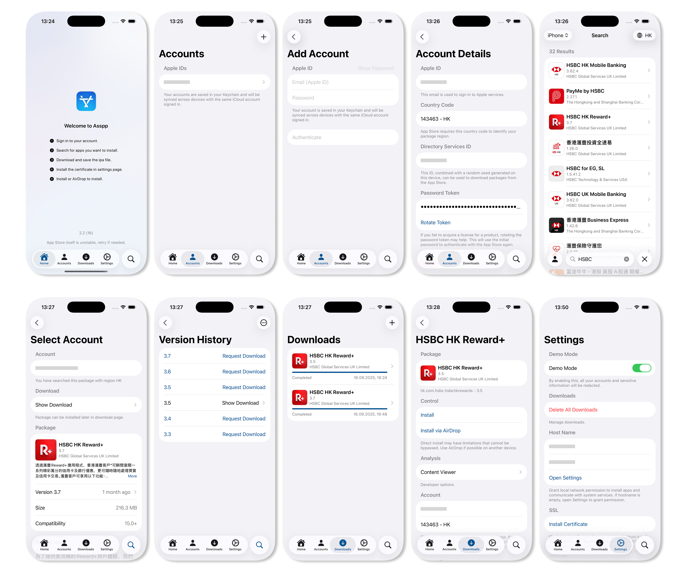

# 爱啪思道

轻松管理多个 App Store 账户。

[English 🇺🇸](../../../README.md)

## 👀 概览

## 🌟 主要功能

- **多账户管理**: 支持多个 Apple ID
- **跨区访问**: 选择您的 App Store 地区
- **应用搜索**: 按关键词搜索应用
- **应用下载**: 从 App Store 下载应用
- **IPA 安装**: 在非越狱设备上安装 IPA
- **IPA 分享**: 轻松分享 IPA 文件
- **历史版本**: 下载应用的历史版本
- **免费应用入库**: 一键将免费应用加入您的购买记录

## 📝 使用须知

### 前提条件

- [iOS App Signer](https://dantheman827.github.io/ios-app-signer/)
- 用于 `app.localhost.qaq.wiki` 的自签名证书（在“设置”中安装）

### 问题排查

- 对于类似 [#1](https://github.com/Lakr233/Asspp/issues/1) 的问题，请使用提供的签名工具。
- 如果安装失败，请确保证书已正确安装。
- 如果应用崩溃或退出，请确认您已登录 App Store 账户，并且您的设备系统版本受支持。

### 安装方式对比

| 项目             | 本地安装           | AirDrop 安装                                 |
| ---------------- | ------------------ | -------------------------------------------- |
| 设备要求         | 单台设备           | 两台设备                                     |
| App Store 兼容性 | 无法检测\*         | 兼容                                         |
| 自动更新         | 不支持             | 支持                                         |
| 前提条件         | 手动安装并信任证书 | 目标设备需登录同一账户，且已安装至少一个 App |
| 网络要求         | 需要               | 不需要                                       |

- 此安装方法不会在 App Store 中注册软件，因此无法自动更新。手动更新可以保留数据，但后续安装无法使用本软件，也无法覆盖现有应用。

## 🚀 快速上手

- 前往 [Releases](https://github.com/Lakr233/Asspp/releases) 页面下载最新版本。
- 或者在 [SideStore](https://sidestore.io) 中添加源

  `https://raw.githubusercontent.com/Lakr233/Asspp/refs/heads/main/Resources/Repos/sidestore.json`

## 📋 已构建的包

请查看 [Releases](https://github.com/Lakr233/Asspp/releases) 页面。

## 🧑‍⚖️ 开源许可

自 2.2.16 版本起，本项目采用 [MIT](../../../LICENSE) 许可证。

## 🥰 鸣谢

- [ipatool](https://github.com/majd/ipatool)
- [ipatool-ios](https://github.com/dlevi309/ipatool-ios)
- [localhost.direct](https://get.localhost.direct/)

_`ipatool-ios` 和 `localhost.direct` 已在当前项目中不再使用。_

---

Copyright © 2025 Lakr Aream. All Rights Reserved.
